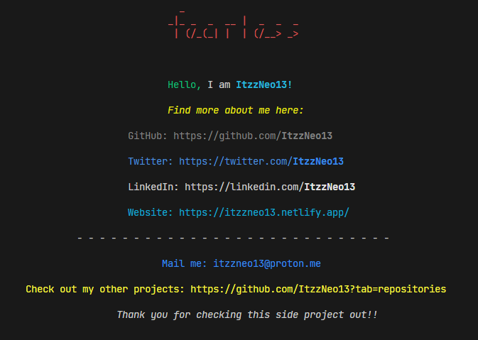

Another command line project made just for fun and experience.

The code might not be that great in terms of efficiency cuz I am not yet good at JS.

Access the card using `npx itzzneo13`

Made with the same concept of [Command Line app](https://github.com/ItzzNeo13/command-line-app)

Preview

- - - - 

#### Stats: 
  

  

- - - - 

P.S. - Update 1.0.1 is just README update. No changes in main code.

Reach out: itzzneo13@proton.me

- - - - 
